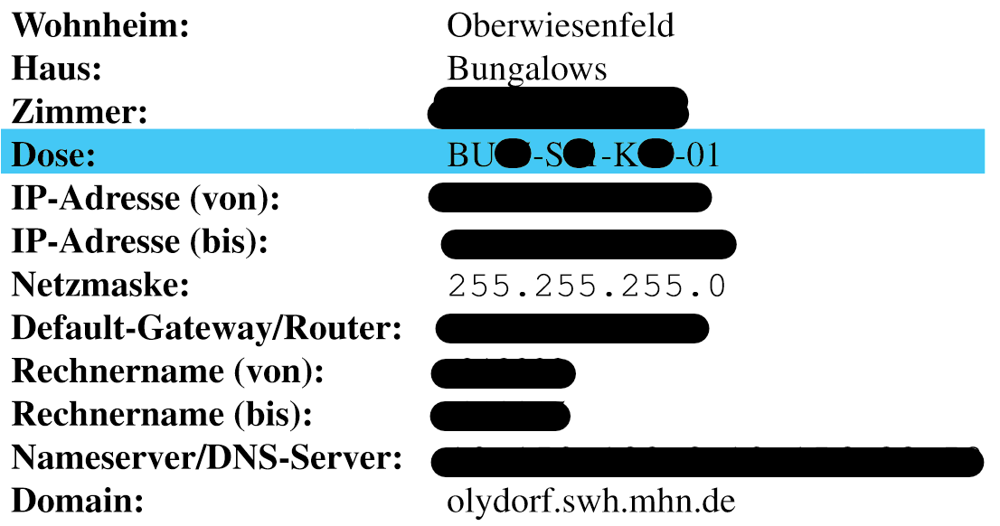

import { Tab, Tabs } from 'nextra-theme-docs'

# Self Service

Here you can find answers to the most common questions and problems that
students contact us for. Please read through this page before getting in touch with us.

### How can I set up my router?

To help you set up your router, we provide a video guide:
[Setup Router with LRZ IP-Sheet - Olynet](https://youtu.be/cfi3lpi6sKQ)

If you are using a Studentenstadt-Router (StuStaNet), you might find this [sheet](https://github.com/OlyNet/wiki/files/11081376/StuStaNet.pdf) helpfull.

### My internet is slow, what can I do?

If this problem occurs during peak times (e.g. in the evening),
it is likely caused by the limited capacity of the dormitory network infrastructure.
Sadly, we cannot do anything to change this. If your internet connection is also
inconsistent, please see [My internet is inconsistent, what can I do](#my-internet-is-inconsistent-what-can-i-do).

### My internet is inconsistent, what can I do?

You can try the following approaches:

- If you are using a WIFI router and connect to the internet via its WIFI, try
  out wired connection to your router via an ethernet cable instead. Plug an
  ethernet cable into one of the yellow or orange ports at the back of your WIFI router
  and the other side of the cable into the ethernet port of your computer.
  If your computer does not have an ethernet port (common for newer notebooks), you
  have to purchase an adapter (e.g. USB-C to ethernet).
- If you are using a rather cheap WIFI router, you can try upgrading to a more powerful one.
  Olynet offers preconfigured routers for this purpose. If you are interested, stop by
  [in our office during the opening hours](/#opening-hours).
- Finally, if the problem still persists, you can try to use a different ethernet cable to connect to
  the wall-mounted network outlet (your ethernet cable might be damaged). If you do not have
  another ethernet cable, you can purchase one from Olynet
  [in our office during the opening hours](/#opening-hours).
- If the problem still persists, we can visit your apartment and check whether your
  wall-mounted network outlet is defective. If it is, we will forward your case to the
  Studentenwerk that handles further repairs.

### Where are the network outlets located?

<Tabs items={['High-rise', 'Bungalow', 'Double Bungalow', 'Hillside']}>
  <Tab>
    At the power outlets left of the wardrobe
  </Tab>
  <Tab>
    On the upper floor below the radiator
  </Tab>
  <Tab>
    In the lowest compartment of the shelf in the "living area" on the ground floor
  </Tab>
  <Tab>
    At the power outlets under the desk
  </Tab>
</Tabs>

### Into which outlet and which port should I plug my cable?

The exact port is specified on the IP-sheet:

Usually the ports are also labelled with "Telefon" (Phone) and "Internet". Plug the
cable into the internet port.

### I didn’t receive my network address sheet (Netzdatenblatt), what can I do?

These are handed out by the Studentenwerk. We are not allowed to hand these out.
Please contact the [Studentenwerk](mailto:wohnen-team1@stwm.de) to resolve this issue.

### I have a DSL router, will it work in this dormitory?

No.

### Does it cost anything for Olynet to configure my router or help me with any problems that I have?

No, we are a student club consisting of volunteers, our work is free of charge. If you decide to
purchase hardware from us, you will however have to pay for it.

### I still questions, how can I contact you?

Shoot us a [mail](mailto:office@olynet.club) or stop by our office during the [opening hours](/#opening-hours).
